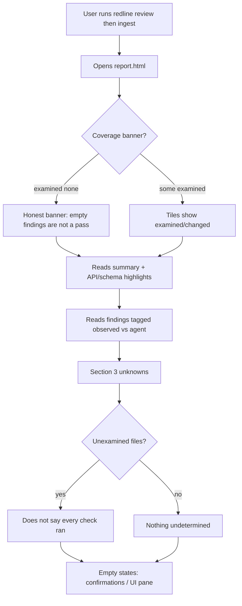
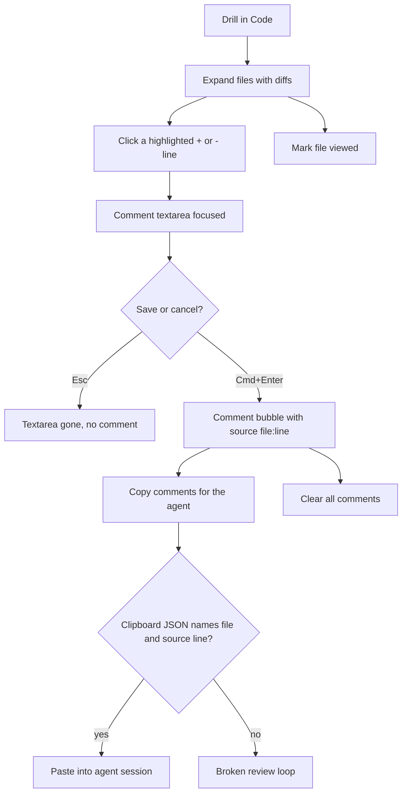
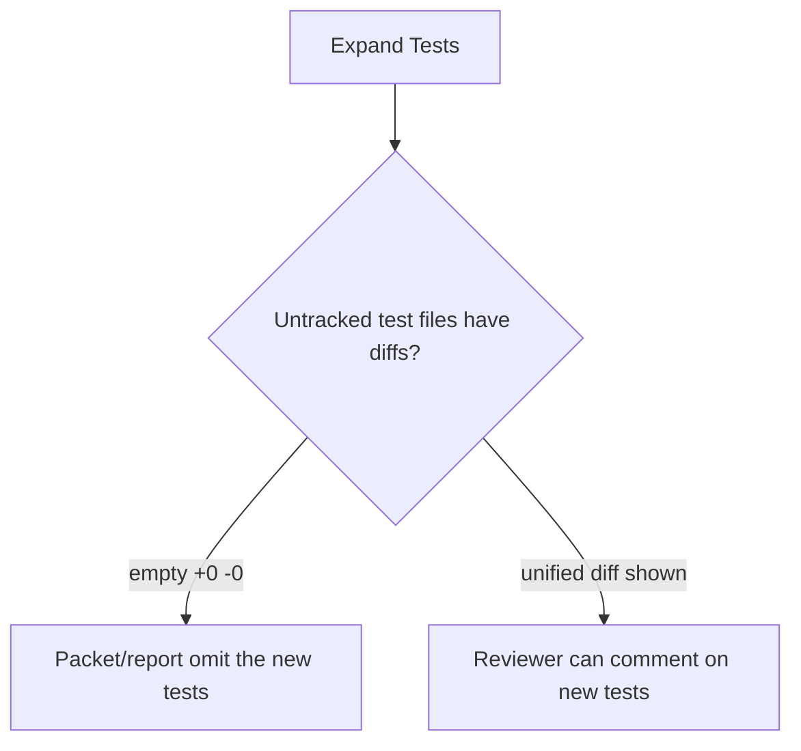

# Dogfood Report — redline-branch

> Diff-scoped browser QA of `redline-branch` vs the trunk. Generated by `ce-dogfood` on 2026-08-29.

<!-- Use repo-relative paths throughout this doc, never absolute paths, so it stays portable. -->
<!-- This template is the source of truth for the report's sections; build the report to this shape rather than from memory. -->

## Diff Summary

- Committed `redline-branch` started equal to `main` (`028a2bf`). Dogfood covered the working-tree remediations of that review-loop (packet, HTML report, PR/branch targets), then the commits landed on this branch.
- HTML report: hunk-header source line numbers on comments, `data-review` localStorage identity, clipboard fallback, honest section 3 when files are unexamined.
- CLI: `ingest` merges a saved session; `sql` is no longer an alias for `run`; custom `--out` is excluded from the next run; `--pr`/`--branch` conflict is reported before git opens.
- Untracked files (new tests) now appear in the packet and Tests pane as `added` with a real unified diff, not `modified +0 −0`.

## Personas

Inferred — this repo has no `STRATEGY.md`, `VISION.md`, or persona docs.

- **Agent reviewer** — drives `redline review` / `ingest`, needs the packet and HTML to distinguish observed facts from LLM judgment, and comments that name real `file:line`.
- **Human reviewer** — opens `report.html`, drills into diffs, leaves comments, copies them back to the agent. Attention is scarce; an empty findings list must not read as a pass.

## Flows Tested

## Test Matrix & Results

| # | Flow | Journey / Scenario | Status | Issue | Fix | Commit |
|---|------|--------------------|--------|-------|-----|--------|
| 1 | Open | Coverage banner + tiles: 0 examined is honest | Pass | - | - | - |
| 2 | Open | Summary, API changes, agent-tagged findings | Pass | - | - | - |
| 3 | Open | Section 3 unknowns, not "every check ran" | Pass | - | - | - |
| 4 | Open | Empty states: confirmations, UI pane did not run | Pass | - | - | - |
| 5 | Drill-in | Expand Code; add/del highlighting | Pass | - | - | - |
| 6 | Drill-in | Click + line; save comment with source file:line | Pass | Comment on `html.go` stored as `internal/report/html.go` line 8 (`+crypto/sha256`), not dump row | - | - |
| 7 | Drill-in | Copy comments JSON for the agent | Pass | Button reads "Copied — paste into your agent session" | - | - |
| 8 | Drill-in | Esc cancels; viewed checkbox; Clear | Pass | Esc dropped the draft; viewed persisted; Clear emptied comments after confirm | - | - |
| 9 | Tests | Untracked files show diffs, not empty | Fixed | Four new `*_test.go` files showed `modified · +0 −0` with empty `pre.diff` | `DiffPath` via `git diff --no-index` against empty file; status from base vs worktree; Stat counts those lines | `d61165f` |
| 10 | Cross-cut | Keyboard/focus on comment widget; no console errors | Pass | Click focuses the textarea; `agent-browser errors` empty | - | - |
| 11 | Cross-cut | Desktop + mobile layout | Pass | 1280×800 and 390×844; no horizontal overflow | - | - |

Status values: `Pending`, `Pass`, `Fixed`, `Skipped`, `Blocked (needs human verify)`, `Blocked (human decision)`. Start every scenario at `Pending` so this table doubles as the resume checkpoint.

## What Was Fixed

### Untracked files had empty diffs — `d61165f`
- **Symptom:** Tests pane listed `graph_test.go`, `ingest_test.go`, `html_test.go`, and `target_test.go` as `modified · +0 −0` with no diff body. The packet had the paths and no content, so a reviewer could not comment on new tests.
- **Root cause:** `git diff REV -- path` emits nothing for files git has never seen. `ChangedPaths` includes them via `WorktreeBlobs`, but `DiffPath` did not. Status was inferred from unified-diff headers, so an empty dump read as `modified`.
- **Fix:** `internal/gitx/git.go` compares untracked paths to an empty file (`git diff --no-index`, treating exit 1 as "here is the diff"). `Stat` counts those lines so the `+N −0` matches. `internal/packet/build.go` labels status from presence in the base tree vs the worktree.
- **Regression test:** `TestDiffPathUntrackedFileIsANewFileDiff`, `TestStatCountsUntrackedAdds` (`internal/gitx/git_test.go`); `TestUntrackedFileHasDiffInPacket` (`internal/run/run_test.go`). These failed before the fix (empty diff / missing stat / status `modified`) and pass after.

### `--pr` and `--branch` together looked like "not a git repository" — `fc0a4f7`
- **Symptom:** `go test ./...` failed `TestResolveRejectsPRAndBranch` (error was missing git repo) and `TestResolveWorktree` (macOS `/var` vs `/private/var`).
- **Root cause:** `Resolve` opened git before checking exclusive flags. Worktree `Dir` is `git rev-parse --show-toplevel`, which symlink-resolves.
- **Fix:** Validate `--pr`/`--branch` first in `internal/target/target.go`. Tests compare paths after `EvalSymlinks`.
- **Regression test:** existing `TestResolveRejectsPRAndBranch` and `TestResolveWorktree` (`internal/target/target_test.go`).

## Paper Cuts (by persona)

- **Human reviewer** — At 390px the sticky comment bar stacks "Copy comments for the agent" above "Clear", eating vertical space. Functional, slightly cramped. Severity: low — deferred.
- **Agent reviewer** — Native `window.confirm` on Clear blocks `agent-browser click` until the dialog is handled (the CLI's auto-dialog path left a hung click). Humans click OK; headless Clear needs JS override. Severity: low — deferred.
- **Agent reviewer** — A Go-only change still shows `0/N files examined` because the only shipped pane is migrations. The banner is honest; the gap is product scope, not a broken screen. Severity: medium — not a defect of this branch.
- **Human reviewer** — Re-running `review` while writing this dogfood report includes `docs/dogfood-reports/...` in the change. Correct, noisy. Severity: low — deferred.

## Console Errors

None. `agent-browser errors` was empty on the initial open, after comment save/copy/clear, and after regenerating the report for the Tests pane.

## Human Verifications

Not applicable — no OAuth, email, payments, or SMS.

## Decisions for a Human

None. The empty-diff bug and the target-resolution test failures were small enough to auto-fix. Expanding coverage beyond the migrations pane is a product decision, not a bug in this diff.

## Learnings

- `git diff REV -- path` does not include untracked files. A tool that treats the working tree as a revision must use `--no-index` (and treat git's exit 1 as success) or it will ship empty diffs for every new file.
- `git diff --numstat` has the same hole; line counts for untracked paths have to be derived from that same diff.
- On macOS, `t.TempDir()` and `git rev-parse --show-toplevel` often disagree by a `/var` → `/private/var` symlink. Compare resolved paths.
- Native `confirm()` is a poor fit for headless dogfood of a static HTML page; a custom in-page confirm would be automatable.

Worth feeding to `ce-compound`: the untracked `git diff` hole — it will recur in any pre-push review tool.

## Final Status

**Ready to ship**, with the coverage caveat above (migrations pane only; Go changes stay unexamined by design of rung 1).

Automated suite: `go test ./...` — **40 passed** in 11 packages after `d61165f`, `fc0a4f7`, and `4489116`.

Browser matrix: 10 Pass, 1 Fixed, 0 Blocked.
